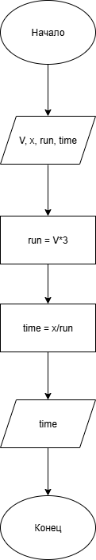

# Домашнее задание к работе 2

## Условие задачи
Мальчик может бегать в три раза быстрее, чем ходить. Скорость его ходьбы равна 4 км/час. Он принял участие в марафонском забеге, но сошел с дистанции, пробежав только х км. Сколько времени он затратил на преодоление этого расстояния?

## 1. Алгоритм и блок-схема

### Алгоритм
1. **Начало**
2. Задать исходные данные:
   - `x` — расстояние, которое необходимо преодолеть мальчику (км).
   - `V` — скорость ходьбы мальчика (км/ч).
3. Вычислить скорость бега мальчика:
   - `run` = `V` * `3`
4. Вычислить время, затраченное на преодоление расстояния:
   - `time` = `x` / `run`
5. Вывести результаты расчетов с подстановкой всех значений в текст.
6. **Конец**

### Блок-схема
 

## 2. Реализация программы
```
#include <stdio.h>
#include <locale.h>
int V, x;
void main()
{
    V = 4;
    x = 24;
    double run = V*3;
    double time = x/run;

    setlocale(LC_CTYPE, "RUS");
    
    printf("Расчёт времени затраченного на путь\n");
    printf("=====================================\n\n");
    printf("Условия задачи:\n");
    printf("Скорость ходьбы = %d\n", V);
    printf("Расстояние, которое преодолел мальчик: %d км\n", x);
    printf("Скорость бега мальчика в 3 раза больше скорости ходьбы.\n\n");
    
    printf("Расчёт:\n");
    printf("Скорость бега мальчика: %d * 3 = %2.1f км/ч\n", V, run);
    printf("Время затраченное на преодоление %d км: %d / %2.1f = %2.1f часа\n", x, x, run, time);
    printf("=====================================\n");
    printf("Время, затраченное на путь: %2.1f часа", time);
}
```
## 3. Результаты работы программы

Расчёт времени затраченного на путь
=====================================

Условия задачи:
Скорость ходьбы = 4
Расстояние, которое преодолел мальчик: 24 км
Скорость бега мальчика в 3 раза больше скорости ходьбы.

Расчёт:
Скорость бега мальчика: 4 * 3 = 12.0 км/ч
Время затраченное на преодоление 24 км: 24 / 12.0 = 2.0 часа
=====================================
Время, затраченное на путь: 2.0 часа

## 4. Информация о разработчике

Калашников Дмитрий бИПТ-251
